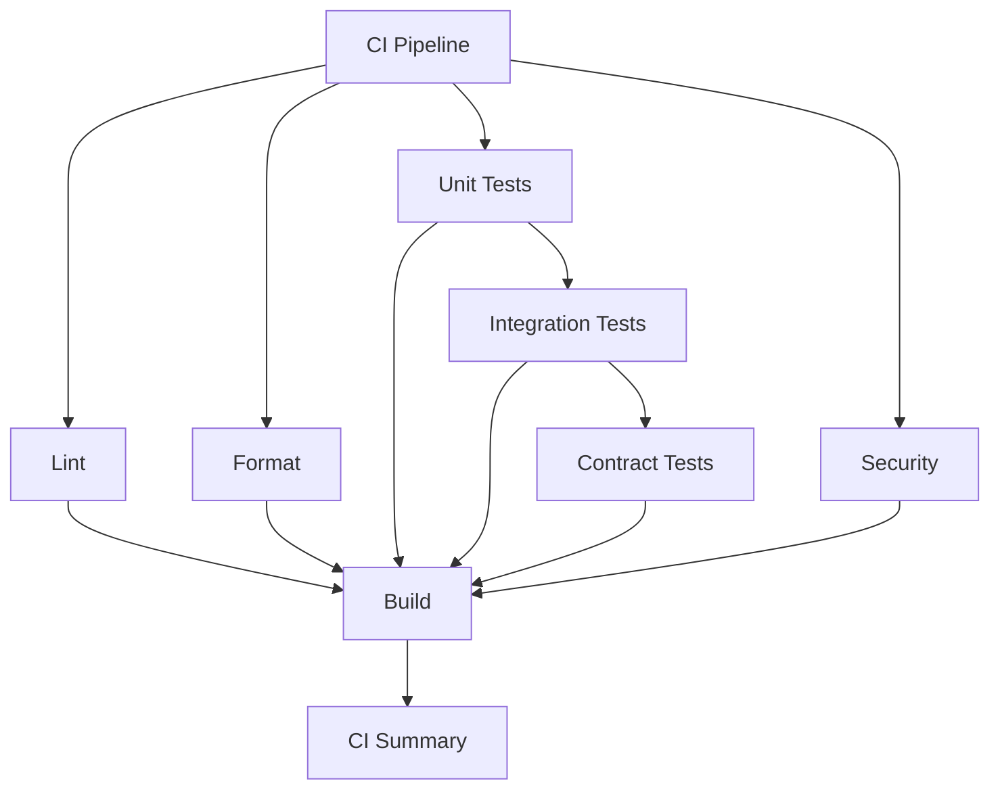

# GitHub Actions Workflows

This directory contains comprehensive GitHub Actions workflows for the cc-dailyuse-bar project, organized into separate files for different testing and build areas.

## Workflow Files

### Core Workflows

- **`ci.yml`** - Main CI pipeline that orchestrates all other workflows

### Composite Actions

- **`.github/actions/setup-go/action.yml`** - Centralized Go environment setup with built-in caching
- **`.github/actions/run-tests/action.yml`** - Unified test execution with coverage reporting

### Testing Workflows

- **`lint.yml`** - Code linting using golangci-lint
- **`fmt.yml`** - Code formatting checks
- **`unit-tests.yml`** - Unit tests with coverage reporting
- **`integration-tests.yml`** - Integration tests with parallel execution
- **`contract-tests.yml`** - Contract tests for service interfaces

### Build & Release Workflows

- **`build.yml`** - Multi-platform builds and releases
- **`security.yml`** - Security scanning and vulnerability checks

### Utility Workflows

- **`benchmarks.yml`** - Performance benchmarking
- **`dependency-update.yml`** - Automated dependency updates

## Features

### DRY Design
- Composite actions for common operations
- Reusable workflows with `workflow_call` triggers
- Consistent Go version and dependency management
- Built-in caching from `actions/setup-go@v5`

### Comprehensive Caching
- Go modules cache
- golangci-lint cache
- Build cache for faster subsequent runs

### Parallel Execution
- Integration tests run in parallel by test suite
- Contract tests run in parallel by service
- Security scanning runs alongside other tests

### Coverage Reporting
- Unit test coverage with Codecov integration
- Integration test coverage
- Contract test coverage
- PR comments with coverage summaries

### Security
- Gosec security scanner
- govulncheck for vulnerability scanning
- Nancy for dependency vulnerability checks
- TruffleHog for secret detection
- Trivy for comprehensive security scanning
- CodeQL analysis

### Multi-Platform Support
- Linux (amd64, arm64)
- Windows (amd64)
- macOS (amd64, arm64)
- Cross-compilation support

## Usage

### Running Individual Workflows
Each workflow can be run independently:
```bash
# Run linting
gh workflow run lint.yml

# Run unit tests
gh workflow run unit-tests.yml

# Run security scan
gh workflow run security.yml
```

### Manual Triggers
All workflows support `workflow_dispatch` for manual execution.

### Scheduled Runs
- Security scanning: Weekly (Monday 2 AM)
- Benchmarks: Weekly (Sunday 3 AM)
- Dependency updates: Weekly (Monday 4 AM)

## Configuration

### Go Version
Default Go version is 1.23, configurable via workflow inputs.

### Linting
Uses `.golangci.yml` configuration file with comprehensive linter settings.

### Test Tags
- Unit tests: No tags required
- Integration tests: `-tags=integration`
- Contract tests: `-tags=contract`

## Artifacts

### Build Artifacts
- Platform-specific binaries
- Release archives for tagged versions

### Test Artifacts
- Coverage reports (HTML and raw)
- Benchmark results
- Security scan reports

## Dependencies

### Required Secrets
- `GITHUB_TOKEN` (automatically provided)

### External Services
- Codecov (for coverage reporting)
- GitHub Security tab (for vulnerability reports)

## Workflow Dependencies



## Best Practices

1. **Fail Fast**: Quick checks (lint, fmt) run first
2. **Parallel Execution**: Independent tests run in parallel
3. **Caching**: Aggressive caching for dependencies and tools
4. **Security First**: Security scanning runs on every PR
5. **Comprehensive Coverage**: Multiple test types with coverage reporting
6. **Multi-Platform**: Builds for all supported platforms
7. **Automated Updates**: Weekly dependency updates
8. **Performance Monitoring**: Regular benchmark runs
