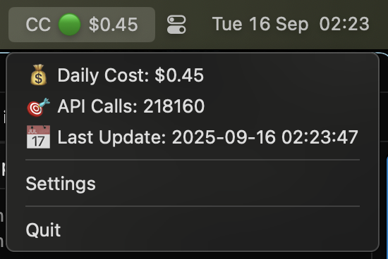

# cc-dailyuse-bar



A system tray application that monitors your daily Claude Code usage and displays real-time cost information in your menu bar.

## Features

- **Real-time monitoring**: Displays current daily usage cost and API call count
- **Status indicators**: Color-coded status (🟢 Green, 🟡 Yellow, 🔴 Red) based on configurable thresholds
- **System tray integration**: Runs in the background with menu bar access
- **Automatic updates**: Configurable polling interval for fresh data
- **XDG compliance**: Stores configuration in standard XDG directories
- **Multi-language support**: English and Japanese localization


The application displays in your system tray as:
- `CC 🟢 $0.45` - Normal usage (below yellow threshold)
- `CC 🟡 $12.50` - High usage (above yellow threshold)
- `CC 🔴 $25.00` - Critical usage (above red threshold)

## Installation

### Prerequisites

- Go 1.21 or later
- `ccusage` binary installed and accessible in PATH
- macOS, Linux, or Windows

### Build from Source

```bash
# Clone the repository
git clone <repository-url>
cd cc-dailyuse-bar

# Install dependencies
make deps

# Build the application
make build

./cc-dailyuse-bar
```

## Configuration

The application uses XDG-compliant configuration storage:

- **Linux/macOS**: `~/.config/cc-dailyuse-bar/config.yaml`
- **Windows**: `%APPDATA%/cc-dailyuse-bar/config.yaml`

### Default Configuration

```yaml
ccusage_path: "ccusage"
update_interval: 30
yellow_threshold: 10.00
red_threshold: 20.00
debug_level: "INFO"
```

### Configuration Options

- `ccusage_path`: Path to the ccusage binary (default: "ccusage")
- `update_interval`: Polling interval in seconds (10-300, default: 30)
- `yellow_threshold`: Cost threshold for yellow warning (default: $10.00)
- `red_threshold`: Cost threshold for red alert (default: $20.00)
- `debug_level`: Logging level - DEBUG, INFO, WARN, ERROR, or FATAL (default: "INFO")

## Usage

### Running the Application

```bash
# Run directly
make run

# Run as daemon (background process)
make daemon

# Or build and run
make build
./cc-dailyuse-bar

# Run as daemon with command line flag
./cc-dailyuse-bar --daemon
```

### System Tray Menu

Right-click the tray icon to access:
- **Usage Information**: Daily cost, API calls, last update time
- **Settings**: View current configuration
- **Quit**: Exit the application

### Status Indicators

- 🟢 **Green**: Usage below yellow threshold (normal)
- 🟡 **Yellow**: Usage above yellow but below red threshold (warning)
- 🔴 **Red**: Usage above red threshold (critical)
- ⚪️ **Gray**: ccusage unavailable or error state

## Development

### Project Structure

```
src/
├── main.go                 # Application entry point with systray integration
├── models/                 # Data models and business logic
│   ├── alert_status.go     # Status enumeration (Green/Yellow/Red/Gray)
│   ├── config.go          # Configuration model with validation
│   ├── template_data.go   # Template data structures for display
│   └── usage_state.go     # Usage state model with status calculation
├── services/              # Business logic layer
│   ├── config_service.go  # XDG-compliant configuration management
│   └── usage_service.go   # ccusage integration and polling service
└── lib/                   # Utilities and shared functionality
    ├── errors.go          # Custom error types with categorization
    ├── logger.go          # Structured logging with configurable levels
    └── template_engine.go # Template processing for display formats

tests/                     # Comprehensive test suite
├── contract/              # Service interface contract tests
├── integration/           # End-to-end workflow tests  
└── unit/                  # Additional unit test coverage
```

### Available Make Targets

```bash
make help                 # Show all available targets
make build               # Build the binary
make run                 # Run the application
make daemon              # Run as daemon (background process)
make test                # Run tests
make test-race           # Run tests with race detection
make bench               # Run benchmarks
make lint                # Run linter
make lint-fix            # Run linter with auto-fix
make fmt                 # Format Go code
make vet                 # Run go vet
make format              # Run fmt + lint-fix together
make clean               # Clean build artifacts
make deps                # Download dependencies
make deps-update         # Update dependencies
make coverage            # Run tests with coverage report
make coverage-func       # Show coverage percentage by function
make coverage-html       # Generate HTML coverage report
make dev-setup           # Set up development environment
make install             # Install the binary
make install-service     # Install as systemd service (Linux)
make uninstall-service   # Remove systemd service (Linux)
make security            # Check for security vulnerabilities
make check               # Run lint, test, and build
make ci                  # CI pipeline (deps, lint, test, build)
```

### Testing

The project includes comprehensive test coverage with multiple test types:

```bash
# Run all tests
make test

# Run tests with coverage report
make coverage

# Run tests with coverage (HTML report)
make coverage-html

# Show coverage by function
make coverage-func

# Run tests with race detection
make test-race

# Run benchmarks
make bench
```

#### Test Structure
- **Unit tests**: `src/*/test.go` - Individual component tests
- **Contract tests**: `tests/contract/` - Service interface contracts  
- **Integration tests**: `tests/integration/` - End-to-end workflows
- **Additional unit tests**: `tests/unit/` - Extra unit test coverage

### Code Quality

```bash
# Run linter
make lint

# Run linter with auto-fix
make lint-fix

# Format code
make fmt

# Run go vet
make vet

# Format + lint-fix combined
make format

# Check for security vulnerabilities
make security

# Run all quality checks (lint, test, build)
make check
```

## Dependencies

- [github.com/getlantern/systray](https://github.com/getlantern/systray) - Cross-platform system tray support
- [github.com/adrg/xdg](https://github.com/adrg/xdg) - XDG Base Directory support  
- [gopkg.in/yaml.v3](https://gopkg.in/yaml.v3) - YAML configuration parsing
- [github.com/stretchr/testify](https://github.com/stretchr/testify) - Testing toolkit

## Requirements

- **ccusage**: The application requires the `ccusage` binary to be installed and accessible
- **Go**: Version 1.21 or later for building from source
- **Platform**: macOS, Linux, or Windows

## Troubleshooting

### Tray Icon Not Visible

1. Check if the application is running: `ps aux | grep cc-dailyuse-bar`
2. Look for the icon in your system tray/menu bar
3. On macOS, check System Preferences > Security & Privacy > Privacy > Accessibility
4. Try running with debug logging: `go run ./src`

### ccusage Not Found

1. Ensure `ccusage` is installed and in your PATH
2. Check the configuration file for the correct path
3. Test manually: `ccusage daily --json`

### Configuration Issues

1. Check the config file location: `~/.config/cc-dailyuse-bar/config.yaml`
2. Validate YAML syntax
3. Check file permissions

### Debug Logging

Enable debug logging by setting the `debug_level` in your configuration file:

```yaml
debug_level: "DEBUG"
```

Available log levels:
- `DEBUG`: Detailed debugging information
- `INFO`: General information (default)
- `WARN`: Warning messages
- `ERROR`: Error messages only
- `FATAL`: Fatal errors only

## Contributing

1. Fork the repository
2. Create a feature branch
3. Make your changes
4. Add tests for new functionality
5. Run the test suite: `make test`
6. Run the linter: `make lint`
7. Submit a pull request

## License

[Add your license information here]

## Changelog

### v1.0.0
- Initial release
- System tray integration
- Real-time usage monitoring
- Configurable thresholds
- XDG-compliant configuration
- Multi-language support
